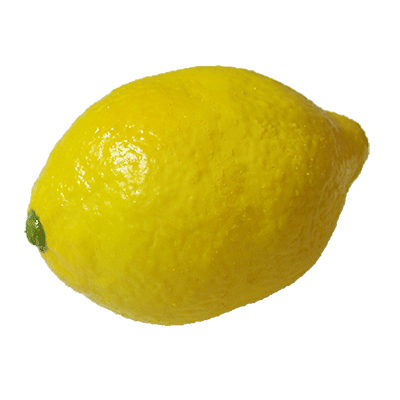

# Stop! Don't Let That Lemon Pass!
## - or -
## Lemon Defect Detection
### A Capstone Data Science Project
### by Chris Sulfrian

# The Problem

As of 8/21/2020 wholesale pricing is widely varying, from [$12-$40 per 38lbs](https://www.marketnews.usda.gov/mnp/fv-report-top-filters?startIndex=1&dr=1&rowDisplayMax=25&portal=fv&navClass=&commAbr=LEM&locAbr=&locName=&varName=&region=&commName=LEMONS&navClass&navType=byComm&volume=&type=shipPrice&repType=shipPriceDaily), while nominal retail pricing is [$0.99/lb](https://www.marketnews.usda.gov/mnp/fv-report-retail?portal=fv&category=retail&type=retail&region=NATIONAL&organic=ALL&navClass=FRUITS&commodity=LEMONS). Assuming the mid-range wholesale price, there's a possible margin of $0.25 per pound (33%). As with so much of modern commerce, minimizing waste can mean the difference between staying a viable business and going under.

Each lemon weighs roughly 1/4 pound and represents a potential gross profit of $0.06. Miscategorizing a non-edible lemon has a negative effect in every circumstance, though quantifying that is difficult. Mis-categorizing an industrial lemon to sell at retail represents a potential loss of a sale. 

So our cost/benefit matrix would look something like this:

# The Data

I found a dataset of 2690 images of lemons, along with annotations for each image that included information about the defects present as well as the overall quality of the image. 

I took the initial 9 categories and distilled them down to 3 categories to make decisions about which channel the lemon should be fed through:
- Retail quality
- Industrial quality
- Unsafe for consumption

Requirements for each category:
- Retail: highest quality
    + image_quality, 

- Commercial
    + (5)blemish, (6)dark_style_remains, (2)illness

- Non-edible:
    + (4)mould, (3)gangrene

Totals for each classification:
- (1)image_quality: 5
- (2)illness: 1743
- (3)gangrene: 449
- (4)mould: 264
- (5)blemish: 2048
- (6)dark_style_remains: 467
- (7)artifact: 451
- (8)condition: 2
- (9)pedicel: 1245

# The Technology

# The Process

# The Results

# References
Dataset: https://github.com/softwaremill/lemon-dataset