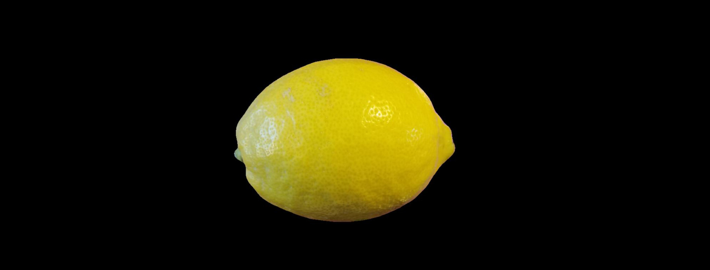
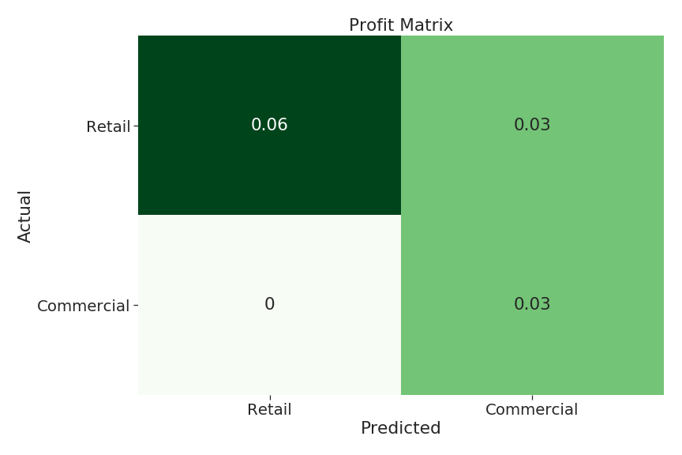
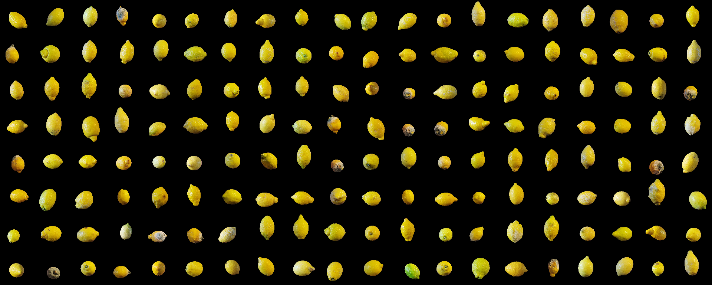
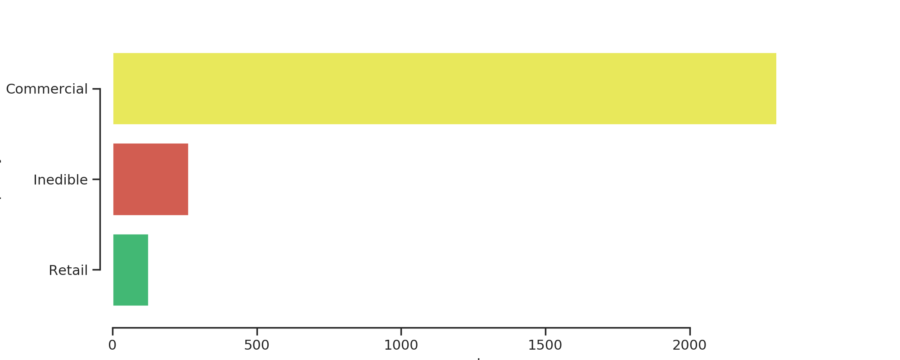
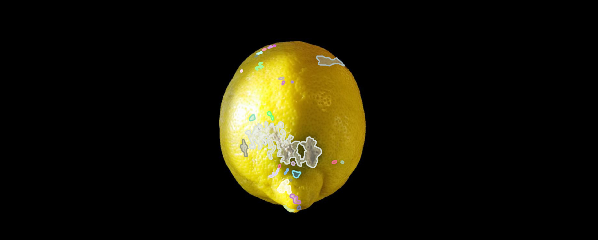
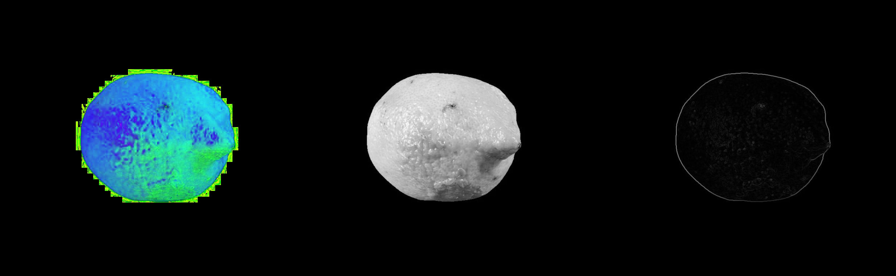
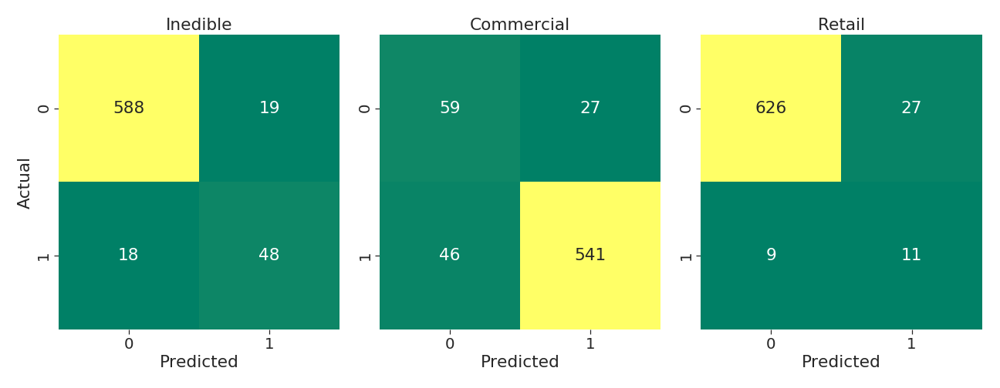
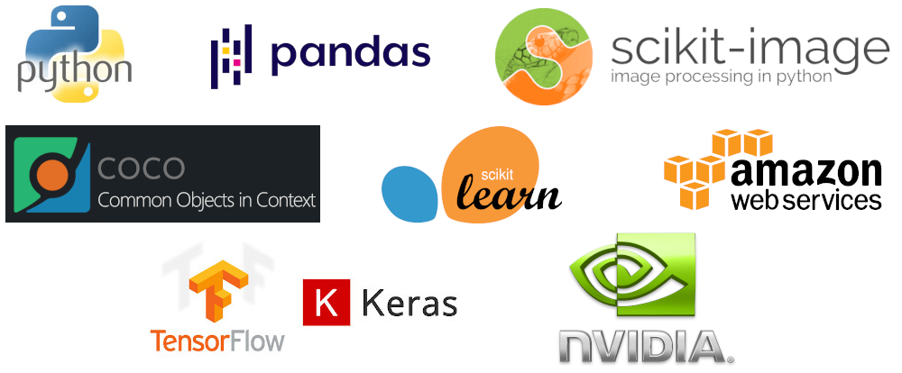

# Lemon Drop - Defect Detection for Process Control
### by Chris Sulfrian

<a href="http://linkedin.com/in/csulfrian" target="_blank">
 
</a>
<br>
<br>
<a href="https://docs.google.com/presentation/d/e/2PACX-1vRRmnENqJE0O9kdFSe7ARbETqaktOXGQK0ssFLO_P1x73wKfxu4DVm_2NqvIehk6O2kTthCMhtyBfHq/pub?start=false&loop=false&delayms=3000" target="_blank">Link to the presentation slides</a>

<br>
<br>
<details>
  <summary>Click to Expand Part 1</summary>

 # Part 1: Logistic Regression
 


# The Problem
Food waste is a big problem in the US, and using sorting machinery augmented with machine learning tools to minimize the chance of food getting wasted would be a very beneficial application of the technology. Consumers tend to be very fickle about the appearance of their produce, so the ideal situation would be to sort every piece with a high degree of scrutiny before it gets distributed to grocery stores food product manufacturers.

This project was designed around the concept of being integrated into an automated sorting/packing line. The machine would implement high speed conveyors moving the fruit along through a brightly lit tunnel, with a gap in between the two belts that facilitates taking high resolution video of each lemon over a uniform black background.

Sorting machine concept: https://youtu.be/Xy1XTY7iqgc

# Business Case

As of 8/21/2020 wholesale pricing is widely varying, from [$12-$41 per 38lbs](https://www.marketnews.usda.gov/mnp/fv-report-top-filters?startIndex=1&dr=1&rowDisplayMax=25&portal=fv&navClass=&commAbr=LEM&locAbr=&locName=&varName=&region=&commName=LEMONS&navClass&navType=byComm&volume=&type=shipPrice&repType=shipPriceDaily), while nominal retail pricing is [$0.99/lb](https://www.marketnews.usda.gov/mnp/fv-report-retail?portal=fv&category=retail&type=retail&region=NATIONAL&organic=ALL&navClass=FRUITS&commodity=LEMONS). Assuming the mid-range wholesale price, there's a possible margin of $0.25 per pound (33%). As with so much of modern commerce, minimizing waste can mean the difference between staying a viable business and going under.

Each lemon weighs roughly 1/4 pound and represents a potential gross profit of $0.06. Miscategorizing a non-edible lemon has a negative effect in every circumstance, though quantifying that is difficult. Mis-categorizing an industrial lemon to sell at retail represents a potential loss of a sale.

The goal then is to maximize the amount of lemons we can send to retail outlets as well as minimize the quantity of lemons being mis-categorized as inedible, both of which will maximize profit.



*Profit matrix with all 'Inedible' fields set to 0 and removed*

# The Data


*Image credit to the dataset creators. Quite beautiful, isn't it?*

I found a dataset of 2690 images of lemons in various states of decay, along with annotations for each image that included information about the defects present as well as the overall quality of the image.

*__List of points of interest__*
|   id | name               |
|-----:|:-------------------|
|    1 | image_quality      |
|    2 | illness            |
|    3 | gangrene           |
|    4 | mould              |
|    5 | blemish            |
|    6 | dark_style_remains |
|    7 | artifact           |
|    8 | condition          |
|    9 | pedicel            |


There are a couple of attributes that occur to varying degrees and could potentially be assigned to commercial or retail quality. I was  conservative with the selection criteria so only the best fruit gets sent to retail outlets. In real lemon distribution there are many categories that lemons fall into. I took the initial 9 categories and distilled them down to 3 categories to make decisions about which channel the lemon should be fed through:

- Non-edible (Class 0): mould, gangrene

- Commercial (Class 1): blemish, dark_style_remains, illness

- Retail (Class 2): fruit with none of the above

The class counts ended up being very unbalanced



*Counts of each quality class*

### The Annotations File
The .JSON formatted annotations file contains multiple entries (on average 12) per image with segmentation detailing the individual areas of interest on each fruit. This snippet of code helps form the following annotated image.

```json
{'id': 6,  
 'iscrowd': 0,  
 'area': 51.0,  
 'category_id': 5,  
 'image_id': 100,  
 'segmentation': [[310.80859375,
   486.7421875,
   308.47572386769025,
   486.20364530558254,
   306.68121739113667,
   312.78253941141884,
   487.81870113447985]],
 'bbox': [306.68121739113667,
  486.20364530558254,
  12.023193392909889,
  6.280772667938436]}
  ```

  *Annotations snippet, COCO-formatted*



*Image with segmentation*

I didn't use the segmentation in this project, but each of those colored areas represents an entry in the annotations file which had to be compared to the criteria decided upon above and assigned a quality class. A significant portion of my time this week was spent writing the code to parse through the whole annotations file, making groups of annotations per image, then determining which category each lemon fell into.


# Image Processing

The images were scaled down to 128x128 pixels and saved with Scikit Image. I then ran tests on the color images as well as two increasingly complex transformations on each of the images. Those included:
- HSV color space conversion
- grayscale
- grayscale with Sobel edge detection



*Not actual images sent through model - full size for human viewing*


*What actually gets sent through the model* 

# The Results

I fit a LogisticRegressionCV model on each of the image transformations on an Amazon Web Services EC2 instance to run determine the best hyperparameters for the predict phase. That freed up my computer to run smaller subsets of the data at the same time. I used ElasticNet regularization with a varying L1 ratio in each run. I also used the `class_weight` attribute of the LogisticRegressionCV model to adjust for the severely unbalanced classes. I then pickled and saved the model for ease of future testing.

The model that ended up working the best was a L2 regularized Logistic Regression, using images that had been preprocessed with grayscaling and Sobel edge finding.



*Three class confusion matrix*

### Performance

Performance metrics on multiclass problems require a different way of thinking than they do on binary classification. This is due to every false positive also counting as a false negative. This fact didn't have much impact though as I wanted to prioritize the True Positive rate (Recall) across all classes from the beginning.

*__Precision Metrics Report__*
|              |  Precision  |  Recall | F1 score | Jaccard | # per class |
| ------------ | ----------- | ------- | -------- | ------- |--------     |
|    Inedible  |     0.68    |  0.76   |   0.72   | 0.56    |   71        |
|  Commercial  |     0.94    |  0.91   |   0.93   | 0.88    |   568       |
|      Retail  |     0.35    |  0.41   |   0.38   | 0.23    |   34        |
|                                                                         |
|    Accuracy  |             |         |   0.87   |         |   673       |
|   Macro avg  |     0.66    |  0.70   |   0.67   |         |   673       |
|Weighted avg  |     0.88    |  0.87   |   0.88   |   0.83  |   673       |


Another import aspect of this choice of preprocessing was how much faster the Sobel images' model fit (22min vs 86min and 127min).

# Conclusion

A qty of 2690 lemons represent a theoretical __$161__ in profit. The classifications I made assume that there will be roughly 11% (284) inedible lemons in that sample which lowers our max profit potential to __$144__. Based on the achieved Recall scores and the profit matrix above, this model has achieved a theoretical gross profit of around __$76__, so about 53% of our max potential.

Tweaking the quality threshold would have a big positive impact on this, as would adding one or two more quality levels.

# Future Work
I plan on trying a couple more transformations on the images to put through the logistic regression. After I have a good feeling for which transforms produce the best accuracy, I'd like to expand on the model selection to put the images through.
- [ ] Test on Naive Bayes
- [ ] Implement a CNN
- [ ] Optimize the code even further
- [ ] Talk with a practicing data scientist about how to actually integrate this concept into a physical system
- [ ] Try it on a physical system?

I'm also very interested in generating my own data to incorporate into my tests to make sure that it has a hope of working in the real world.

I look forward to working on this project more!

# Technologies


# References
Dataset: https://github.com/softwaremill/lemon-dataset

</details>
