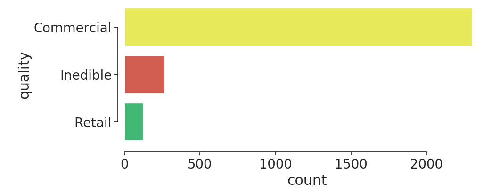

# Stop! Don't Let That Lemon Pass!
## - or -
## Lemon Defect Detection
### A Capstone Data Science Project
### by Chris Sulfrian


# The Problem
Food waste is a big problem in the US, and using machine learning tools to minimize the chances of food getting wasted would be a very beneficial application of the technology. Consumers tend to be very fickle about the appearance of their produce, so the ideal situation would be to sort every piece with a high degree of scrutiny before it gets distributed to grocery stores food product manufacturers.

This project was designed around the concept of being integrated into an automated sorting/packing line. The machine would implement high speed conveyors moving the fruit along through a brightly lit tunnel, with a gap in between the two belts that facilitates taking high resolution video of each lemon over a uniform black background. 

# Business Case

As of 8/21/2020 wholesale pricing is widely varying, from [$12-$40 per 38lbs](https://www.marketnews.usda.gov/mnp/fv-report-top-filters?startIndex=1&dr=1&rowDisplayMax=25&portal=fv&navClass=&commAbr=LEM&locAbr=&locName=&varName=&region=&commName=LEMONS&navClass&navType=byComm&volume=&type=shipPrice&repType=shipPriceDaily), while nominal retail pricing is [$0.99/lb](https://www.marketnews.usda.gov/mnp/fv-report-retail?portal=fv&category=retail&type=retail&region=NATIONAL&organic=ALL&navClass=FRUITS&commodity=LEMONS). Assuming the mid-range wholesale price, there's a possible margin of $0.25 per pound (33%). As with so much of modern commerce, minimizing waste can mean the difference between staying a viable business and going under.

Each lemon weighs roughly 1/4 pound and represents a potential gross profit of $0.06. Miscategorizing a non-edible lemon has a negative effect in every circumstance, though quantifying that is difficult. Mis-categorizing an industrial lemon to sell at retail represents a potential loss of a sale. 

So our cost/benefit matrix would look something like this:


# The Data


*Image credit to the dataset creators*

I found a dataset of 2690 images of lemons, along with annotations for each image that included information about the defects present as well as the overall quality of the image.

|   id | name               |
|-----:|:-------------------|
|    1 | image_quality      |
|    2 | illness            |
|    3 | gangrene           |
|    4 | mould              |
|    5 | blemish            |
|    6 | dark_style_remains |
|    7 | artifact           |
|    8 | condition          |
|    9 | pedicel            |


I took the initial 9 categories and distilled them down to 3 categories to make decisions about which channel the lemon should be fed through:

- Non-edible (Class 0):
    + mould, gangrene

- Commercial (Class 1):
    + blemish, dark_style_remains, illness

- Retail (Class 2):
    + image_quality

The class counts ended up being very unbalanced




### The Annotations File
The .JSON formatted annotations file contains multiple entries (on average 12) per image with segmentation detailing the individual areas of interest on each fruit. 

```json
{'id': 6,  
 'iscrowd': 0,  
 'area': 51.0,  
 'category_id': 5,  
 'image_id': 100,  
 'segmentation': [[310.80859375,
   486.7421875,
   308.47572386769025,
   486.20364530558254,
   306.68121739113667,
   312.78253941141884,
   487.81870113447985]],
 'bbox': [306.68121739113667,
  486.20364530558254,
  12.023193392909889,
  6.280772667938436]}
  ```


I didn't use the segmentation in this project, but each of those colored areas represents an entry in the annotations file which had to be compared to the criteria decided upon above and assigned a quality class. A significant portion of my time this week was spent writing the code to parse through the whole annotations file, making groups of annotations per image, then determining which category each lemon fell into.

# The Technology
- COCO image annotation tools
- Scikit Image
- Scikit Learn
- Amazon EC2 instance


# The Process

The images were scaled down to 128x128 pixels and saved with Scikit Image. I then ran tests on the color images as well as two increasingly complex transformations on each of the images. Those included:
- full color
- grayscale
- grayscale with Sobel edge detection


*Not actual images sent through model - full size for human viewing*


*What actually gets sent through the model* 

I ran PCA on the images after preprocessing, and it had some effect

I tested a LogisticRegressionCV model on each of the image transformations on the AWS EC2 instance to run determine the best hyperparameters for the predict phase. I used an ElasticNet regularization with a varying L1 ratio in each run. I also used the `class_weight` attribute of the LogisticRegressionCV model to make sure that the severely unbalanced classes were balanced within the model.

# The Results

The model that ended up working the best was a L2 regularized Logistic Regression, using images that had been preprocessed with grayscaling and Sobel edge finding. Using a weighted average for the scores:

| Metric | Inedible (0) | Commercial (1) | Retail (2) | Average |
| ------ | ------------ | ---------------| ---------- | ------- |
| Jaccard | 56%         | 86%            | 23%        | 83%     |
| Specificity (True Neg) | 73% | 92%     | 55%        |         |
| Misses (False Neg) | 27% | 8%          | 45%        |         |

Another import aspect of this choice of preprocessing was how much faster the Sobel images' model fit (22min vs 86min and 127min).

An interesting thing that came up in the cross validation is the grayscale images had the opposite ideal regularization of the other treatments, even the HSV and Sobel-filtered ones.

# Future Work
I plan on trying a couple more transformations on the images to put through the logistic regression. After I have a good feeling for which transforms produce the best accuracy, I'd like to expand on the model selection to put the images through.
- [ ] Naive Bayes
- [ ] Implement a CNN
- [ ] Optimize the code even further

I'm also very interested in generating my own data to incorporate into my tests to make sure that it has a hope of working in the real world.

I look forward to working on this project more!

# References
Dataset: https://github.com/softwaremill/lemon-dataset